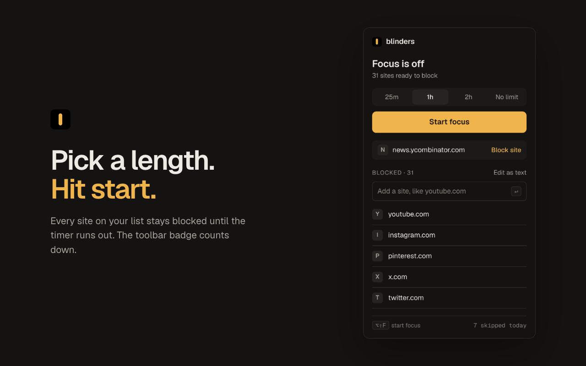
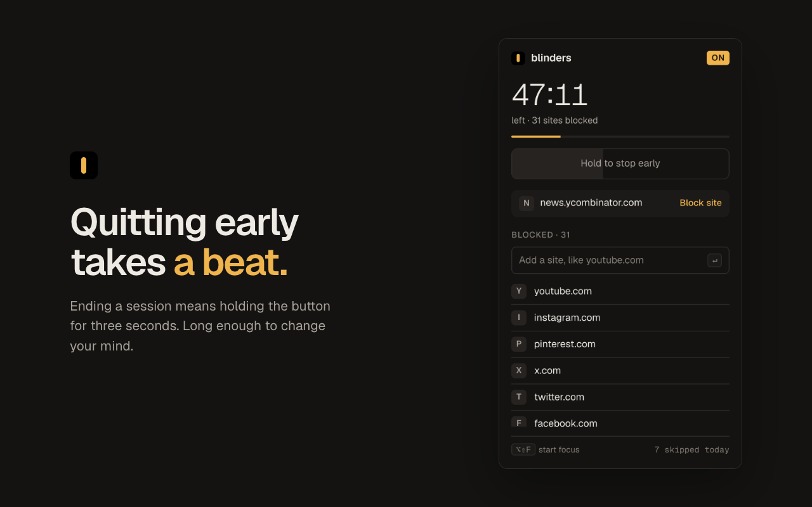
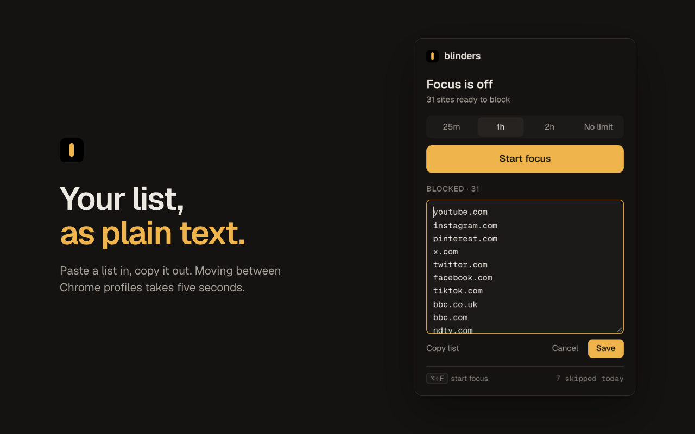

<p align="center">
  
</p>

<h1 align="center">Blinders</h1>

<p align="center">
  <strong>Put blinders on the sites that steal your focus.</strong><br>
  A calm, private site blocker for Chrome. Free and open source.
</p>

<p align="center">
  <a href="#install"><strong>Add to Chrome</strong></a> ·
  <a href="#how-it-works">How it works</a> ·
  <a href="#privacy">Privacy</a> ·
  <a href="#faq">FAQ</a>
</p>

<p align="center">
  <a href="docs/blinders-promo.mp4">
    
  </a>
  <br>
  <sub><a href="docs/blinders-promo.mp4">▶ Watch with sound</a></sub>
</p>

---

You open YouTube "for a second." Forty minutes later you surface, unsure how you got there.

Blinders adds just enough friction to break that loop. Pick how long you want to focus, press start, and every site on your list waits until you're done. No account, no tracking, and nothing ever leaves your browser.

## How it works

**1. Pick a length.** 25 minutes, an hour, two hours, or no limit.

**2. Start focus.** The toolbar badge counts down, and any distracting tabs you already had open are caught straight away.

**3. Distractions can wait.** Open a blocked site and you get a quiet page with the time remaining and one button that takes you back to what you were working on.

<p align="center">
  
  
  
</p>

## Built for the moment you reach for a distraction

|  |  |
| --- | --- |
| **One-click blocking**<br>Block the site you're on straight from the popup. | **Quitting takes a beat**<br>Ending a session early means holding a button for three seconds. Usually long enough to change your mind. |
| **A locked list**<br>During a session you can add sites, but not remove them. | **Back to work in one step**<br>The block page offers "Return to" the last useful page in that tab, or closes it. |
| **Your list, as text**<br>Paste a list in or copy it out. Moving between Chrome profiles takes seconds. | **Keyboard first**<br><kbd>Alt</kbd>+<kbd>Shift</kbd>+<kbd>F</kbd> (<kbd>⌥⇧F</kbd> on Mac) starts a session from anywhere. |
| **A gentle scoreboard**<br>See how many distractions you skipped today. No streaks, no guilt. | **Small and quiet**<br>About 80 KB, no build step, no background network activity. |

## Install

**Chrome Web Store:** coming soon.

**From source:**
1. Download or clone this repo.
2. Open `chrome://extensions` and turn on **Developer mode**.
3. Click **Load unpacked** and choose the folder.

Blinders comes with a starter list of common distractions. Remove anything you need for work, or add your own.

## Privacy

Blinders is built to know as little as possible.

- **Your block list** syncs through your own Chrome account, like any Chrome setting.
- **Your session, today's count, and where "Return to" goes** stay on your device. The return page is erased when Chrome closes.
- **No network requests, no analytics, no ads, no account.**

Chrome shows a "read and change data on all websites" warning because an extension needs that access to redirect a site. Blinders only ever looks at addresses, never page content, and every line of code is here to read. Full details are in [PRIVACY.md](PRIVACY.md).

## FAQ

<details>
<summary><strong>Why does Blinders need access to all websites?</strong></summary>

Chrome only lets an extension redirect a site if it has access to that site, and your list can include any site. Blinders uses the access to compare page addresses with your list. It never reads what's on the page.
</details>

<details>
<summary><strong>Does it work in Incognito?</strong></summary>

Yes, once you allow it. Open `chrome://extensions`, click **Details** on Blinders, and turn on **Allow in Incognito**.
</details>

<details>
<summary><strong>How do I use the same list in another Chrome profile?</strong></summary>

Profiles signed in to the same Google account sync automatically. For other profiles, open **Edit as text**, click **Copy list**, then paste it into Blinders in the other profile.
</details>

<details>
<summary><strong>What if I genuinely need a blocked site mid-session?</strong></summary>

Hold **Stop** for three seconds in the popup. The pause is deliberate: it gives you a moment to decide whether you really need it.
</details>

<details>
<summary><strong>Does it work in Edge, Brave, or Arc?</strong></summary>

It's built for Chrome. Other Chromium browsers that install from the Chrome Web Store should work, but they aren't tested yet.
</details>

## Why Blinders

Distraction rarely starts as a decision. Your hands open the tab before your brain has weighed in. Willpower isn't what's missing; a half-second of friction is. Blinders is that half-second.

If it helps you too, a star or a review on the Chrome Web Store means a lot. Ideas and bug reports are welcome in [Issues](../../issues).

<details>
<summary><strong>Development</strong></summary>

<br>

Plain HTML, CSS, and JavaScript on Manifest V3. No build step: edit a file and reload the extension at `chrome://extensions`.

| File | What it does |
| --- | --- |
| `background.js` | Service worker: blocking rules, timer, badge, shortcut |
| `guard.js` | Backup block for sites that load from their own offline cache |
| `popup.*` | The toolbar popup |
| `blocked.*` | The page shown in place of a blocked site |
| `shared.js` | Default list, URL normalization, helpers |
| `theme.css` | Colors, type, and the logo mark |

```bash
npm install     # once
npm test        # end-to-end tests in a real Chrome (needs a network connection)
npm run package # builds dist/blinders-<version>.zip for the Chrome Web Store
```
</details>

## License

[MIT](LICENSE). Geist and Geist Mono are used under the [SIL Open Font License](fonts/OFL.txt). Provided as-is, without warranty.
